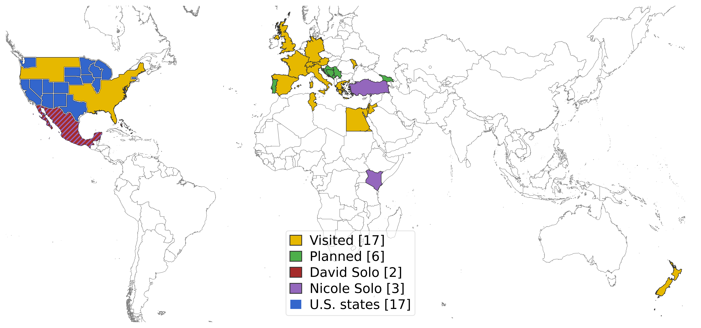

Web Version: [https://davidrrice.github.io/TravelMap/](https://davidrrice.github.io/TravelMap/)

# Travel Map Generator

A command-line Python tool for generating world maps that highlight countries (and optionally U.S. states) from user-supplied lists.  
It uses [Natural Earth](https://www.naturalearthdata.com/) shapefiles with [GeoPandas](https://geopandas.org/) and [Matplotlib](https://matplotlib.org/). Created by [David R. Rice](https://davidrrice.github.io/).

The tool is designed to:
- Plot multiple country lists (e.g., *visited*, *planned*, *solo trips*).
- Use different colors for each list.
- Handle overlaps: if a country appears in multiple lists, it is filled with the first list’s color and overlaid with *colored hatches for additional memberships.
- Count how many countries (and states) were actually matched and display that in the legend.
- Support multiple projections (Web Mercator and Robinson).
- Optionally zoom the map to the selected countries.
- Optionally include or exclude **outlying territories** (e.g. overseas departments, Hawaii, French Guinea, etc.).
- Export the result in multiple formats (`.png`, `.svg`, `.jpg`, `.pdf`).

---

## Requirements

- Python 3.9+
- [GeoPandas](https://geopandas.org/)
- [Matplotlib](https://matplotlib.org/)
- [Shapely](https://shapely.readthedocs.io/)

Install dependencies:

```bash
pip install geopandas matplotlib shapely
```

---

## Setup

1. Download the repository

2. Download the Natural Earth data (1:10m resolution):
   - [Admin 0 – Countries](https://www.naturalearthdata.com/downloads/10m-cultural-vectors/10m-admin-0-countries/)
   - [Admin 1 – States/Provinces](https://www.naturalearthdata.com/downloads/10m-cultural-vectors/10m-admin-1-states-provinces/)

3. Place the files inside a folder named **`NaturalEarth/`** next to the script:

```
project-root/
├── NaturalEarth/
│   ├── ne_10m_admin_0_countries.shp
│   ├── ne_10m_admin_0_countries.dbf
│   ├── ne_10m_admin_0_countries.shx
│   ├── ne_10m_admin_1_states_provinces.shp
│   └── ...
└── travel_map.py
```

4. Prepare one or more text files containing **ISO3 country codes**, one per line.  
Example (`visited.txt`):

```
USA
FRA
DEU
MEX
```

Optionally, prepare a U.S. states file (one state name per line). Example (`states.txt`):

```
California
Wisconsin
Texas
```

---

## Usage

Run the script:

```bash
python travel_map.py
```

You will be prompted for:
1. Projection (`1` = Web Mercator, `2` = Robinson).
2. Whether to exclude outlying territories (`y` = cluster within 700 km, `n` = all territories).
3. Whether to zoom to the selected countries.
4. Output format (`svg`, `png`, `pdf`, or `jpg`).
5. A color palette (`1`, `2`, or `3`).
6. Paths to your country list text files (e.g. "visited.txt").
7. Labels for each list of countries (e.g. "Visited")
7. Optionally, a states list file (states.txt).
8. Output filename.

---

## Examples

### Example 1: Two lists with overlap

Files:

**visited.txt**
```
USA
MEX
CAN
FRA
```

**planned.txt**
```
MEX
JPN
AUS
```

Run:

```bash
python travel_map.py
```

Choose:
- Projection: `2` (Robinson)  
- Include outlying territories: `y`  
- Zoom: `y`  
- Format: `png`  
- Palette: `1`  
- Lists: `visited.txt`, label = *Visited*; `planned.txt`, label = *Planned*  
- States: skip  
- Output filename: `my_travel_map`  

Result:
- `MEX` (Mexico) is in both lists → base color from *Visited* (first file) + `//` hatch in *Planned*’s color.  
- `USA` and `CAN` only in *Visited* → solid fill.  
- `JPN` and `AUS` only in *Planned* → solid fill.  
- Legend shows `Visited [3]`, `Planned [2]`.  
- Map saved as `my_travel_map.png`.  

---

### Example 2: With U.S. states

**states.txt**
```
California
New York
Wisconsin
```

During the run, provide `states.txt` when prompted.  
Selected states will appear in a contrasting blue color with white outlines, and the legend will show:  
`U.S. states [3]`.

---

## Color Palettes

Three 6-color palettes are included (first four maximize contrast):

**Palette 1** (Gold + Muted Tones)  
```
#e6b800, #4daf4a, #a52a2a, #9467bd, #1f77b4,  #8c564b
```

**Palette 2** (Soft Pastels)  
```
#4e79a7, #f28e2b, #e15759, #76b7b2, #59a14f, #edc948
```

**Palette 3** (Elegant Muted)  
```
#2b83ba, #abdda4, #fdae61, #d7191c, #7570b3, #66c2a5
```

---

## Output

- Map exported to chosen format (`.png`, `.svg`, `.jpg`, `.pdf`) with dpi=600.  
- Legend includes each list label and number of matched countries (and states if provided).  
- Overlaps are shown with **hatching**:
  - 2nd membership: `//` hatch in 2nd list’s color.  
  - 3rd membership: `\\` hatch in 3rd list’s color.  
  - 4th+: dotted hatch in gray.  

---

## License

This project uses [Natural Earth](https://www.naturalearthdata.com/) data (public domain).  
Code is released under the MIT License.
